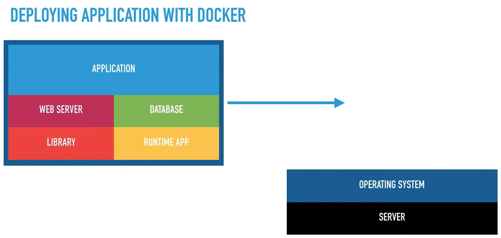
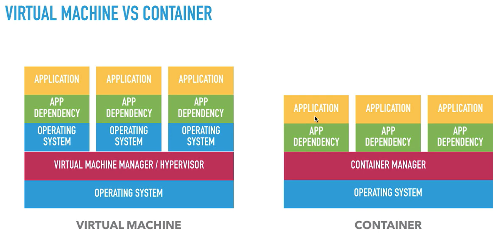
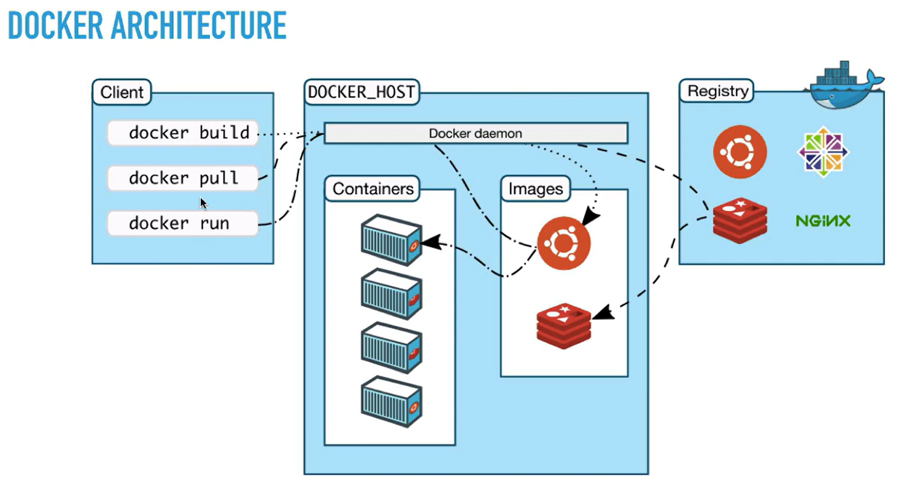
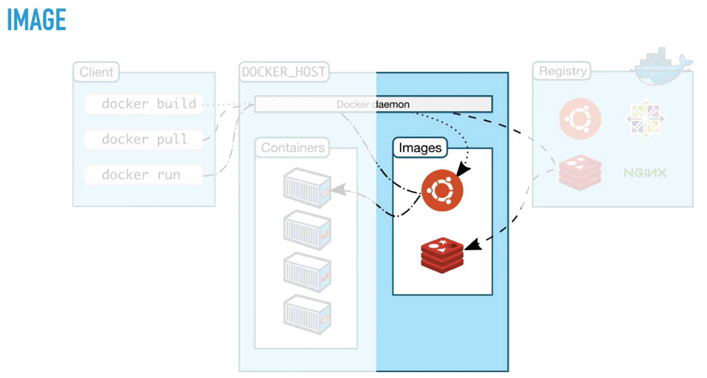
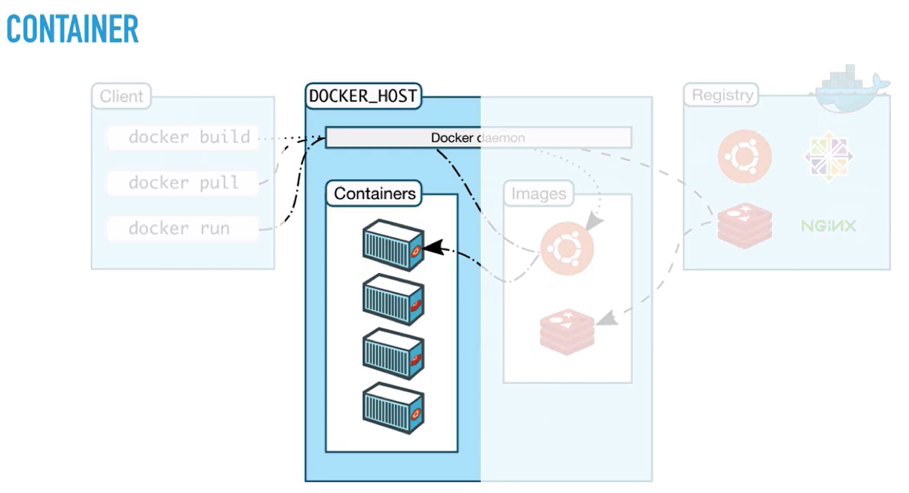
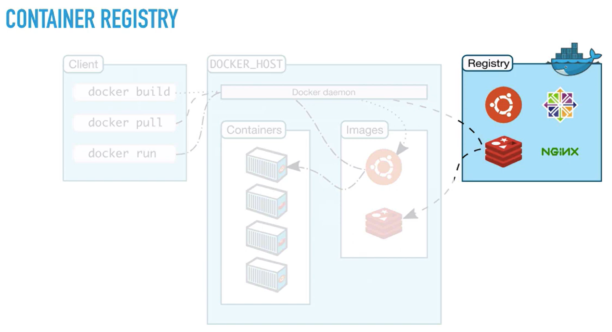

# Materi Docker - Day 1

## 1. Pengenalan Docker

### 1.1. Apa itu Docker?

Docker adalah sebuah **platform containerization** yang digunakan untuk mengemas aplikasi beserta seluruh dependensinya (library, runtime, konfigurasi) ke dalam satu unit yang disebut **container**.

Dengan Docker, aplikasi dapat dijalankan secara **konsisten** di berbagai environment (development, testing, production) tanpa masalah perbedaan sistem.

> Prinsip utama Docker: **"Build once, run anywhere"**

---

### 1.2. Konsep Dasar Container

Container adalah lingkungan terisolasi yang:
- Menyertakan aplikasi
- Menyertakan web server
- Menyertakan library
- Menyertakan runtime aplikasi

Namun **tidak membawa Operating System sendiri**, melainkan berbagi OS kernel dengan host.

Hal ini membuat container:
- Lebih ringan
- Lebih cepat dijalankan
- Lebih efisien dibanding Virtual Machine

---

### 1.3. Deploy Aplikasi Tanpa Docker


Pada deployment tradisional (tanpa Docker), alur deploy aplikasi biasanya seperti berikut:

#### Arsitektur
- Server (Hardware)
- Operating System
- Library
- Runtime Application
- Web Server
- Database
- Application

#### Penjelasan
Aplikasi **tidak berdiri sendiri**, melainkan sangat bergantung pada environment server.

Beberapa permasalahan yang sering terjadi:
- Perbedaan versi library
- Perbedaan runtime (Node, PHP, Java, dll)
- Konfigurasi server yang berbeda
- Error seperti: *"It works on my machine"*

Jika ingin memindahkan aplikasi ke server lain, maka:
- Semua dependensi harus di-install ulang
- Konfigurasi harus disesuaikan ulang
- Risiko error sangat tinggi

---

### 1.4. Deploy Aplikasi Menggunakan Docker



Pada deployment menggunakan Docker, aplikasi dikemas menjadi **container**.

#### Arsitektur
- Server (Hardware)
- Operating System
- Docker Engine
- Container:
  - Application
  - Web Server
  - Database
  - Library
  - Runtime App

#### Penjelasan
Semua kebutuhan aplikasi sudah berada di dalam container.

Keunggulan pendekatan ini:
- Environment selalu konsisten
- Tidak perlu install manual dependency di server
- Aplikasi mudah dipindahkan antar server
- Proses deploy lebih cepat dan rapi

Server hanya perlu:
- Operating System
- Docker Engine

---

### 1.5. Perbedaan Tanpa Docker vs Dengan Docker

| Aspek | Tanpa Docker | Dengan Docker |
|------|-------------|---------------|
| Dependency | Install manual di server | Sudah dikemas dalam container |
| Konsistensi Environment | Rentan berbeda | Konsisten |
| Deployment | Kompleks | Sederhana |
| Portability | Rendah | Tinggi |
| Skalabilitas | Sulit | Mudah |
| Risiko Error | Tinggi | Lebih rendah |

---

### 1.6. Kesimpulan

Docker membantu developer dan DevOps untuk:
- Menyederhanakan proses deployment
- Mengurangi konflik environment
- Meningkatkan efisiensi pengembangan dan produksi

Docker sangat cocok digunakan untuk:
- Microservices
- Cloud deployment
- CI/CD pipeline
- Aplikasi modern berbasis web

<br>

## 2. Perbedaan Container vs Virtual Machine

### 2.1. Pengantar

Sebelum Docker dan container populer, **Virtual Machine (VM)** adalah teknologi utama untuk menjalankan banyak aplikasi dalam satu server fisik.  
Container hadir sebagai solusi yang **lebih ringan, cepat, dan efisien**.

Gambar yang ditampilkan memperlihatkan perbedaan arsitektur **Virtual Machine** (kiri) dan **Container** (kanan).

---

### 2.2. Virtual Machine (VM)

#### Arsitektur Berdasarkan Gambar

Lapisan Virtual Machine terdiri dari:
1. Server (hardware)
2. Operating System (Host OS)
3. Virtual Machine Manager / Hypervisor
4. Guest Operating System (setiap VM)
5. App Dependency
6. Application

📌 **Setiap aplikasi berjalan di VM terpisah dan memiliki Operating System sendiri**

#### Penjelasan
- Hypervisor bertugas membagi resource server ke beberapa VM
- Setiap VM:
  - Memiliki OS sendiri
  - Memiliki dependency sendiri
  - Terisolasi penuh dari VM lain

#### Dampak
- Konsumsi resource besar (RAM & storage)
- Waktu boot lama (karena harus menyalakan OS)
- Kurang efisien jika aplikasi kecil atau banyak service

---

### 2.3. Container

#### Arsitektur Berdasarkan Gambar

Lapisan Container terdiri dari:
1. Server (hardware)
2. Operating System (Host OS)
3. Container Manager (Docker Engine)
4. App Dependency
5. Application

📌 **Container tidak membawa Operating System sendiri**

#### Penjelasan
- Semua container **berbagi kernel OS yang sama**
- Container hanya berisi:
  - Aplikasi
  - Dependency yang dibutuhkan aplikasi
- Container dikelola oleh Container Manager (misalnya Docker)

#### Dampak
- Jauh lebih ringan
- Startup sangat cepat
- Resource server lebih efisien

---

### 2.4. Perbandingan Langsung VM vs Container



| Aspek | Virtual Machine | Container |
|-----|---------------|-----------|
| OS | Setiap VM punya OS sendiri | Share OS host |
| Resource | Boros (RAM & Storage) | Ringan |
| Startup Time | Lambat | Sangat cepat |
| Isolasi | Sangat kuat | Cukup (process-level) |
| Portability | Terbatas | Sangat tinggi |
| Skalabilitas | Sulit | Mudah |
| Cocok untuk | OS berbeda, legacy app | Microservices, cloud app |

---

### 2.5. Penjelasan Visual dari Gambar

#### Virtual Machine (kiri gambar)
- Terdapat **Operating System di setiap application stack**
- Hypervisor berada di antara hardware dan VM
- Semakin banyak VM → semakin besar beban OS

#### Container (kanan gambar)
- Tidak ada OS di tiap application
- Container Manager langsung berjalan di atas OS
- Application stack lebih tipis dan ringan

➡️ Inilah alasan container bisa menjalankan **lebih banyak aplikasi** di server yang sama dibanding VM.

---

### 2.6. Kapan Menggunakan VM dan Kapan Container?

#### Gunakan Virtual Machine jika:
- Membutuhkan OS berbeda (Linux & Windows bersamaan)
- Butuh isolasi tingkat tinggi
- Menjalankan aplikasi legacy

#### Gunakan Container jika:
- Aplikasi modern (web / API)
- Microservices
- CI/CD pipeline
- Deployment cepat dan scalable

---

### 2.7. Kesimpulan

Container dan Virtual Machine memiliki tujuan yang sama: **isolasi aplikasi**.  
Namun pendekatannya berbeda:

- Virtual Machine → isolasi berbasis OS
- Container → isolasi berbasis process

Docker dan container menjadi standar modern karena:
- Lebih cepat
- Lebih hemat resource
- Lebih fleksibel untuk cloud dan DevOps

<br>

## 3. Docker Engine & Docker Architecture

### 3.1. Pengertian Docker Engine

Docker Engine adalah **inti dari Docker** yang bertugas untuk:
- Membangun image
- Menjalankan container
- Mengelola lifecycle container
- Menghubungkan client, image, container, dan registry

Docker Engine menggunakan arsitektur **client–server**.

---

### 3.2. Komponen Utama Docker Architecture



Berdasarkan gambar, Docker Architecture terdiri dari tiga komponen utama:
1. Docker Client
2. Docker Host (Docker Server / Docker Daemon)
3. Docker Registry

---

### 3.3. Docker Client

#### Apa itu Docker Client?
Docker Client adalah antarmuka yang digunakan user untuk berinteraksi dengan Docker.

Biasanya berupa:
- Command Line Interface (CLI)
- Perintah `docker ...`

#### Contoh Perintah (sesuai gambar)
- `docker build`
- `docker pull`
- `docker run`

📌 Docker Client **tidak menjalankan container**, melainkan:
- Mengirim perintah ke Docker Daemon melalui REST API
- Bisa berada di mesin yang sama atau berbeda dengan Docker Host

---

### 3.4. Docker Host (Docker Server)

Docker Host adalah mesin yang:
- Menjalankan Docker Engine
- Menyimpan image
- Menjalankan container

Docker Host terdiri dari beberapa bagian penting.

---

### 3.5. Docker Daemon (`dockerd`)

#### Peran Docker Daemon
Docker Daemon adalah service utama yang:
- Menerima perintah dari Docker Client
- Mengelola image
- Membuat dan menjalankan container
- Berkomunikasi dengan Docker Registry

📌 Semua aktivitas Docker **diproses oleh Docker Daemon**, bukan client.

---

### 3.6. Docker Images



#### Penjelasan
Docker Image adalah:
- Template read-only
- Berisi aplikasi + dependency + konfigurasi

Contoh image pada gambar:
- Ubuntu
- Redis
- Nginx

Image bisa berasal dari:
- Hasil `docker build`
- Hasil `docker pull` dari registry

📌 Image **tidak bisa dijalankan langsung**, harus diubah menjadi container.

---

### 3.7. Docker Containers



#### Penjelasan
Docker Container adalah:
- Instance dari Docker Image
- Lingkungan runtime aplikasi

Ciri container:
- Ringan
- Terisolasi
- Bisa dibuat banyak dari satu image

📌 Pada gambar terlihat **banyak container** yang berasal dari image yang sama.

---

### 3.8. Docker Registry



#### Apa itu Docker Registry?
Docker Registry adalah tempat penyimpanan Docker Image.

Contoh registry:
- Docker Hub (default)
- Private Registry
- Cloud registry (AWS ECR, GCR, dll)

#### Fungsi Registry
- Menyimpan image
- Membagikan image
- Versi image (tag)

📌 Pada gambar terlihat image seperti Ubuntu, Redis, Nginx berasal dari registry.

---

### 3.9. Alur Kerja Docker (Sesuai Gambar)

#### a. `docker build`
1. Docker Client mengirim perintah ke Docker Daemon
2. Docker Daemon membaca Dockerfile
3. Image dibuat dan disimpan di Docker Host

#### b. `docker pull`
1. Docker Client meminta image
2. Docker Daemon menarik image dari Docker Registry
3. Image disimpan secara lokal

#### c. `docker run`
1. Docker Daemon mengecek image
2. Jika image tidak ada → pull dari registry
3. Image dijalankan menjadi container

---

### 3.10. Ringkasan Arsitektur Docker

| Komponen | Fungsi |
|--------|--------|
| Docker Client | Mengirim perintah |
| Docker Daemon | Memproses perintah |
| Docker Image | Template aplikasi |
| Docker Container | Aplikasi berjalan |
| Docker Registry | Penyimpanan image |

---

### 3.11. Kesimpulan

Docker Engine menggunakan arsitektur client–server untuk:
- Memisahkan interface dan eksekusi
- Memudahkan automasi
- Mendukung deployment skala besar

Pemahaman Docker Architecture sangat penting sebelum masuk ke:
- Dockerfile
- Docker Image vs Container
- Docker Compose
- Orkestrasi (Kubernetes)

<br>

## 4. Docker Image vs Docker Container & Container Registry

### 4.1. Docker Image

#### Pengertian
Docker Image adalah **template read-only** yang berisi:
- Source aplikasi
- Dependency
- Runtime
- Konfigurasi

Image **belum berjalan**, hanya cetakan.

#### Penjelasan dari Gambar
Pada gambar *IMAGE*:
- Image berada di dalam **Docker Host**
- Image bisa berasal dari:
  - `docker build` (buat sendiri)
  - `docker pull` (ambil dari registry)
- Satu image bisa digunakan untuk membuat **banyak container**

📌 Analogi: *Image = blueprint / installer aplikasi*

---

### 4.2. Docker Container

#### Pengertian
Docker Container adalah **instance berjalan (runtime)** dari Docker Image.

Container:
- Berjalan di atas Docker Engine
- Terisolasi
- Ringan
- Bisa dibuat banyak dari satu image

#### Penjelasan dari Gambar
Pada gambar *CONTAINER*:
- Terlihat banyak container dalam satu Docker Host
- Semua container berasal dari image
- Container dijalankan oleh Docker Daemon

📌 Analogi: *Container = aplikasi yang sedang berjalan*

---

### 4.3. Perbedaan Singkat Image vs Container

| Aspek | Docker Image | Docker Container |
|-----|-------------|----------------|
| Status | Tidak berjalan | Sedang berjalan |
| Sifat | Read-only | Read-write |
| Fungsi | Template | Runtime aplikasi |
| Jumlah | Biasanya sedikit | Bisa banyak |

---

### 4.4. Container Registry

#### Pengertian
Container Registry adalah **tempat penyimpanan Docker Image**.

Contoh:
- Docker Hub
- Private Registry
- Cloud Registry

#### Penjelasan dari Gambar
Pada gambar *CONTAINER REGISTRY*:
- Registry berada di luar Docker Host
- Docker Host:
  - `docker pull` → ambil image dari registry
  - `docker push` → kirim image ke registry
- Registry menyimpan image seperti Ubuntu, Redis, Nginx

📌 Registry berfungsi sebagai **pusat distribusi image**

---

### 4.5. Alur Singkat Hubungan Ketiganya

1. Image disimpan di Registry
2. Docker Host menarik image dari Registry
3. Image dijalankan menjadi Container

---

### 4.6. Kesimpulan Singkat

- **Image** → cetakan aplikasi
- **Container** → aplikasi berjalan
- **Registry** → gudang image

Pemahaman ini penting sebelum masuk ke:
- Dockerfile
- Docker build & run
- Docker Compose

<br>

## 5. Build & Run Container Sederhana (Step-by-Step)

Materi ini menjelaskan cara menjalankan container Docker secara bertahap menggunakan image dari registry.

---

### 5.1. Melihat Docker Image yang Tersedia

```bash
docker images
```

**Fungsi:**
* Menampilkan daftar Docker image yang tersedia di lokal
* Melihat repository, tag (versi), dan ukuran image

📌 Jika image belum ada, maka perlu melakukan `docker pull`.

---

### 5.2. Mengambil Image dari Registry (Tanpa Versi)

```bash
docker pull nama-images
```

**Contoh:**
```bash
docker pull nginx
```

**Penjelasan:**
* Docker akan mengambil **versi terbaru (latest)** secara default
* Image disimpan di Docker Host

---

### 5.3. Mengambil Image dengan Versi Tertentu

```bash
docker pull nama-images:versi
```

**Contoh:**
```bash
docker pull nginx:1.25
```

**Penjelasan:**
* Lebih **stabil dan terkontrol**
* Direkomendasikan untuk environment produksi

---

### 5.4. Melihat Container yang Sedang Berjalan

```bash
docker container ls
```

**Fungsi:**
* Menampilkan container yang **sedang berjalan (running)**

---

### 5.5. Melihat Semua Container (Running & Stopped)

```bash
docker container ls -a
```

**Fungsi:**
* Menampilkan semua container, termasuk yang berhenti

---

### 5.6. Membuat Container (Belum Dijalankan)

```bash
docker container create --name namacontainer images:versi
```

**Contoh:**
```bash
docker container create --name web-nginx nginx:1.25
```

**Penjelasan:**
* Container dibuat dari image
* Status container masih **created**, belum running

---

### 5.7. Menjalankan Container

```bash
docker container start namacontainer
```

**Contoh:**
```bash
docker container start web-nginx
```

**Penjelasan:**
* Container mulai berjalan
* Aplikasi di dalam container aktif

---

### 5.8. Menghentikan Container

```bash
docker container stop namacontainer
```

**Contoh:**
```bash
docker container stop web-nginx
```

**Penjelasan:**
* Container dihentikan dengan aman
* Data container masih ada

---

### 5.9. Mengekspos Port Container ke Host

#### a. Saat Membuat Container
```bash
docker container create \
--name web-nginx \
-p 8080:80 \
nginx:1.25
```

**Penjelasan:**
* `8080` → port di host
* `80` → port di container
* Akses aplikasi via: `http://localhost:8080`

#### b. Menggunakan `docker run` (Create + Start)
```bash
docker run -d \
--name web-nginx \
-p 8080:80 \
nginx:1.25
```

**Keterangan:**
* `-d` → detached mode (jalan di background)
* Lebih praktis untuk penggunaan sehari-hari

---

### 5.10. Ringkasan Alur Singkat

1. Pull image dari registry
2. Buat container dari image
3. Jalankan container
4. Ekspos port agar bisa diakses dari luar

---

### 5.11. Contoh Skenario Lengkap

```bash
docker pull nginx:1.25
docker container create --name web-nginx -p 8080:80 nginx:1.25
docker container start web-nginx
docker container ls
```

**Buka browser:**
```
http://localhost:8080
```

---

### 5.12. Catatan Penting

* Satu container bisa punya banyak port
* Satu port host hanya bisa dipakai satu container
* Gunakan versi image, hindari `latest` untuk produksi
